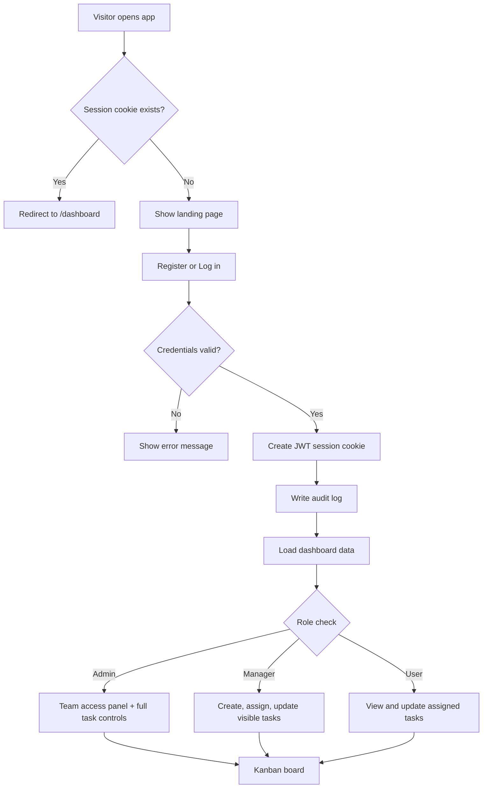

# Ethara Tasks

Ethara Tasks is a secure, multi-user task management system built with Next.js 16, Prisma 7, SQLite, JWT authentication, and role-based access control. It is designed to feel production-ready: users can sign in securely, manage work from a Kanban-style dashboard, and collaborate through a clear Admin / Manager / User permission model.

---

## ✨ Key Features

### 🔐 Authentication & Security
- Secure JWT-based authentication using HTTP-only cookies
- Password hashing with bcrypt
- Input validation with zod
- Session-based access control with route protection
- First registered user is automatically assigned as Admin

### 👥 Role-Based Access Control
- **Admin**: full system control over users, roles, tasks, and access management
- **Manager**: create, assign, and manage tasks across the workspace
- **User**: view and update assigned tasks

### 📊 Task Management Dashboard
- Interactive Kanban board
- Task creation, editing, reassignment, and deletion
- Quick status updates with optimistic UI behavior
- Search and filtering by status, priority, and assignee
- Task statistics overview for the currently visible set

### 🛠 Team Access Panel
- Manage team members from a single admin panel
- Change user roles without leaving the dashboard
- Role changes apply on the next sign-in

### 📜 Audit Logging
Tracks:
- Login and logout events
- Task creation, updates, and deletion
- Role changes
- Workspace reads and other important activity

---

## 🧰 Tech Stack

- **Frontend:** Next.js 16, React 19
- **Backend:** Next.js Server Actions
- **Database:** SQLite + Prisma ORM
- **Authentication:** JWT via `jose`
- **Validation:** Zod
- **Password Hashing:** bcrypt
- **Styling:** Tailwind CSS 4

---

## 📁 Project Structure

```text
src/
├── app/
│   ├── page.tsx                   # Landing page
│   ├── layout.tsx                # Root layout and metadata
│   ├── globals.css               # Global styles and theme
│   ├── auth-actions.ts           # Login, register, logout actions
│   ├── dashboard/
│   │   ├── page.tsx              # Authenticated dashboard entry point
│   │   └── task-actions.ts       # Task and role mutations
│   ├── login/
│   │   └── page.tsx              # Login page
│   ├── register/
│   │   └── page.tsx              # Registration page
│   └── tasks/
│       └── page.tsx              # Legacy route redirect to /dashboard
│
├── components/
│   ├── dashboard/
│   │   ├── DashboardWorkspace.tsx
│   │   ├── DashboardWorkspaceSkeleton.tsx
│   │   └── TeamAccessPanel.tsx
│   └── tasks/
│       ├── QuickCompleteCheckbox.tsx
│       ├── TaskBoard.tsx
│       ├── TaskFilter.tsx
│       ├── TaskForm.tsx
│       ├── TaskItem.tsx
│       └── TaskStats.tsx
│
├── lib/
│   ├── auth/
│   │   ├── authorization.ts
│   │   ├── constants.ts
│   │   ├── jwt.ts
│   │   ├── password.ts
│   │   ├── schemas.ts
│   │   ├── session.ts
│   │   ├── types.ts
│   │   └── users.ts
│   ├── db/
│   │   ├── audit.ts
│   │   └── bootstrap.ts
│   └── tasks/
│       ├── constants.ts
│       ├── filters.ts
│       ├── queries.ts
│       └── schemas.ts
│
├── generated/
│   └── prisma/                   # Generated Prisma client
└── types/
    └── better-sqlite3.d.ts

prisma/
├── schema.prisma                 # Database schema
├── seed.ts                       # Permission and role seed data
└── migrations/                   # SQLite migration history

public/                           # Static assets
```

---

## ⚙️ Installation & Setup

### 1. Clone the repository

```bash
git clone <your-repo-url>
cd ethara-tasks
```

### 2. Install dependencies

```bash
npm install
```

### 3. Create environment variables

Create a `.env.local` file in the project root:

```env
DATABASE_URL="file:./dev.db"
JWT_SECRET="your-32-character-secret-or-longer"
JWT_EXPIRES_IN="7d"
BCRYPT_SALT_ROUNDS=12
```

### 4. Start the application

```bash
npm run dev
```

Visit `http://localhost:3000` in your browser.

The database is bootstrapped automatically on first use. If the SQLite file does not exist yet, the app creates it, runs the base schema, and seeds roles and permissions.

---

## 🗄 Database

This project uses SQLite with Prisma ORM.

### Prisma Commands

```bash
npm run db:generate
npm run db:migrate
npm run db:push
npm run db:seed
npm run db:studio
```

---

## 📌 Available Scripts

```bash
npm run dev        # Start the development server
npm run build      # Generate Prisma client and build the app
npm run start      # Run the production server
npm run lint       # Run ESLint
npm run typecheck  # Run TypeScript checks
```

---

## 🔄 Application Flow

### Authentication Flow

```text
User -> Register/Login -> JWT created in HTTP-only cookie -> Dashboard access
```

### Task Workflow

```text
Create task -> Assign task -> Track progress -> Update status -> Complete task
```

### Pseudocode

```text
START
  open /
  if session cookie exists:
    redirect to /dashboard
  else:
    show landing page

REGISTER
  collect name, email, password
  validate input
  if first user:
    assign Admin role
  else:
    assign User role
  hash password
  create user and role mapping
  write audit log
  create JWT session cookie
  redirect to /dashboard

LOGIN
  collect email and password
  validate input
  load user by email
  compare password hash
  create JWT session cookie
  write audit log
  redirect to /dashboard

DASHBOARD
  read session from cookie
  load current user, visible tasks, assignable users, and team members
  apply filters and build task stats
  if Admin or Manager:
    show create task form
  if Admin:
    show team access panel
  render Kanban board by status
  allow updates, quick complete, delete, and role changes based on access
```

### Flow Diagram



---

## 🧠 Core Concepts Used

- Role-Based Access Control (RBAC)
- Next.js Server Actions
- Secure authentication and session handling
- ORM-based data modeling
- Modular component architecture
- Audit logging for traceability

---

## 🎯 Why This Project Stands Out

- Production-ready security model with JWT, bcrypt, and protected routes
- Clean, scalable architecture with clear separation of concerns
- Real collaboration features, not just a static task board
- Automatic admin bootstrap for simple onboarding
- Easy to extend later with PostgreSQL, real-time notifications, or cloud deployment

---

## 🚀 Future Improvements

- Real-time notifications
- Mobile responsiveness improvements
- PostgreSQL deployment
- Advanced analytics dashboard
- File attachments for tasks

---

## 📄 License

MIT License

---

## 👨‍💻 Author

Saurabh Raj